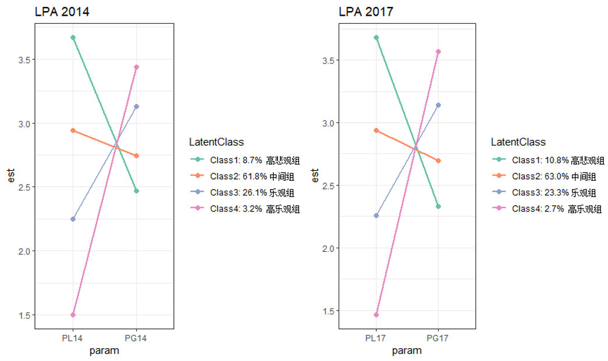

## 老年人自我感知老化的潜在转变分析

### 研究背景
研究表明，自我感知老化（Self-Perceptions of Aging，SPA)——老年人在老化过程中所产生的来源于老化刻板印象
和自我评价的主观感受和情绪反应——与老年人的健康密切相关。积极的自我感知老化有助于：
- 延缓晚年身体功能的衰退 (Westerhof et al., 2014) ；
- 保持健康的生活方式     (Levy & Myers, 2004) ；
- 保持良好的主观幸福感   (Steverink et al., 2001) ；

### 研究目的
本研究从个体中心的角度出发，综合自我感知老化各维度，借助德国老化调查(German Aging Survey,DEAS)项目数据
库2014年和2017年数据，采用潜在剖面分析和随机截距潜在转变分析，揭示老年人自我感知老化的潜在类别、各类别
随时间的转变及其它因素对老年人自我感知老化潜在类别发生和类别间转变的影响。

### 研究方法

### 研究结果

